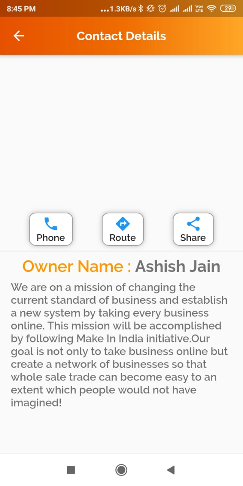

# Jeevika-Customer
An app where local shops can register themselves and customers can see their product catalogue and place order via call 
 
 <h3>Frontend</h3>
 &nbsp&nbspFlutter Framework with dart.
 <h3>Backend</h3>
    &nbsp&nbspCloud firestore/ Firebase.
    
   # UI Design   
  
  
  <h3>Test Qr Code</h3>
   
 
  
  <h3>Login Page</h3>
   
   
  <h3>Home Page</h3> 
 

 <h3>Security Catefory</h3> 
 

<h3>Shop Home Page</h3> 
 
 
<h3>Camera Category</h3> 
 
 
 <h3>Camera Description</h3> 
 
 
 
 <h3>Contact Page</h3> 
 
 
 
 <h3>Qr Code Sharing</h3> 
 
 
